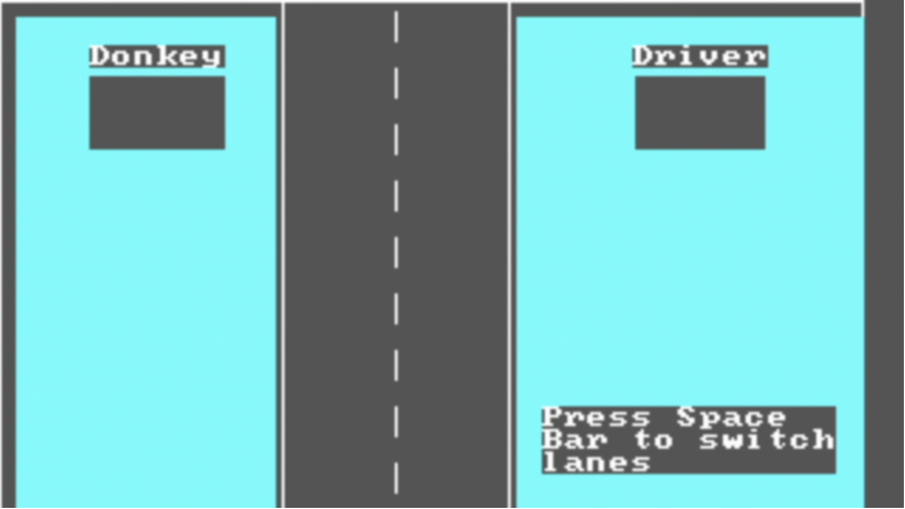
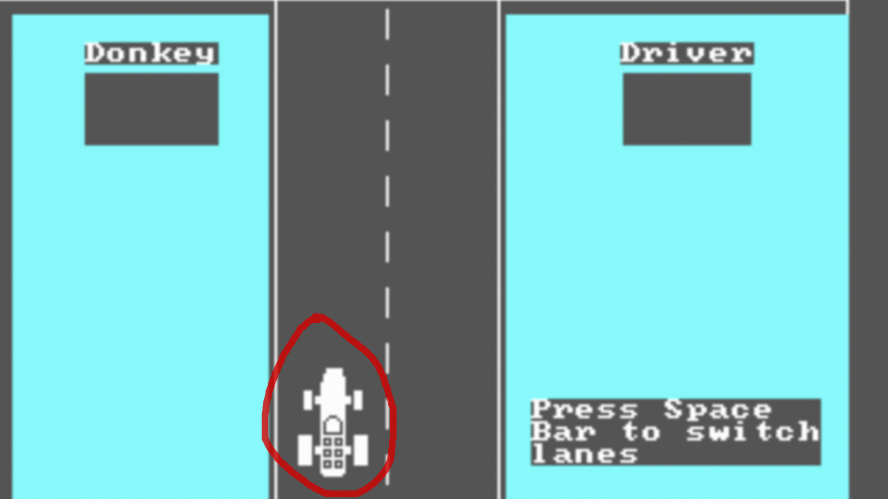

# Tutorial: jogo Donkey

**Autores**: Rodrigo

**Conhecimento prévio necessário**: estruturas de seleção (if/else) e estruturas de repetição (for/while).

**Objetivo de aprendizagem**: ao final deste tutorial, o estudante deve ser capaz de compreender a estrutura `while` e modificar a condição de repetição de acordo com o que o problema pede.

## Iniciando

Neste tutorial você vai aprender a desenvolver um clone do jogo [DONKEY.BAS](https://en.wikipedia.org/wiki/DONKEY.BAS), no qual você dirige um carro e deve desviar dos obstáculos na estrada.

## Carregando as imagens

Primeiramente vamos carregar as imagens que vamos usar no jogo: a pista, o carro e o obstáculo. Para isso, vamos usar a função `loadImage`. A seguir, vamos desenhar a pista na posição (0, 0) -- canto superior esquerdo da tela -- usando a função `drawImage`:

```cpp
#include <inge9>
int main() {
  loadImage("pista", "https://cdn.discordapp.com/attachments/834879522981281865/838902445685473300/pista.png");
  loadImage("carro", "https://cdn.discordapp.com/attachments/834879522981281865/838902448256712715/carro.png");
  loadImage("obstaculo", "https://cdn.discordapp.com/attachments/834879522981281865/838902449992892447/obstaculo.png");
  
  drawImage("pista", 0, 0);
  
  return 0;
}
```



## Desenhando o carro

Vamos usar a variável `faixa` para determinar em qual faixa da pista o carro se encontra: `0` se o carro estiver do lado esquerdo, e `1` se o carro estiver do lado direito da pista. Vamos usar um `if` para desenhar o carro na posição correta. No código abaixo, `...` representa o código de carga de imagens que acabamos de ver.

```cpp
#include <inge9>
int main() {
  int faixa = 0;

  // código do loadImage...
  
  drawImage("pista", 0, 0);
  
  if (faixa == 0) {
    drawImage("carro", 215, 250);
  } else {
    drawImage("carro", 295, 250);
  }

  return 0;
}
```

Na função `drawImage`, o primeiro número representa a coordenada `x` e o segundo número representa a coordenada `y`.



## Controlando o carro

Queremos que, quando o jogador pressionar `Espaço`, o carro se mova para a outra faixa. Para isso, vamos criar um loop infinito que consiste de identificar se o jogador pressionou espaço, alterar a faixa se necessário, e redesenhar tudo.

Para alterar a faixa, vamos usar o seguinte código: `faixa = 1 - faixa;`. Desta forma, se `faixa` for `0`, vai se tornar `1` e vice-versa.

```cpp
#include <inge9>
int main() {
  int faixa = 0;
  
  loadImage("pista", ...);
  loadImage("carro", ...);
  loadImage("obstaculo", ...);
  
  while (true) {
    // processa teclas
    if (isKeyDown(" ")) {
	    faixa = 1 - faixa;
      clearKey(" ");
    }
    
    // desenha
    drawImage("pista", 0, 0);
    if (faixa == 0) {
      drawImage("carro", 215, 250);
    } else {
      drawImage("carro", 295, 250);
    }
    
    // aguarda
    delay(30);
  }

  
  return 0;
}
```

Para verificar se o usuário pressionou `Espaço`, usamos a função `isKeyDown`, passando como parâmetro uma string composta de um espaço em branco. Se a tecla está pressionada, trocamos a faixa do carro e a seguir "limpamos" a tecla (com `clearKey`) para que na próxima iteração do loop consideremos que a tecla não está pressionada.

Ao final do loop é necessário aguardar um tempo; no caso, escolhemos 30 milissegundos:

```cpp
delay(30);
```

## Adicionando um obstáculo

O obstáculo aparece em uma faixa e vai caindo ao longo do tempo, com velocidade constante. Por isso, precisaremos de duas variáveis para representar o obstáculo: `obsFaixa` e `obsY`. A cada iteração do loop, `obsY` cresce.

```cpp
#include <inge9>
int main() {
  // ...
  int obsFaixa = 1;
  int obsY = 0;
  
  // ...

  while (true) {
    // processa teclas
    // ...
    
    // move obstáculo
    obsY += 2;
    
    // desenha
    drawImage("pista", 0, 0);
    if (obsFaixa == 0) {
      drawImage("obstaculo", 210, obsY);
    } else {
      drawImage("obstaculo", 290, obsY);
    }
    // ...
  }
  
  return 0;
}
```

## Colidindo com obstáculo

Agora vamos checar se o carro colide com o obstáculo e; nesse caso, finalizar o jogo. Para isso precisamos considerar as dimensões da imagem do carro -- 54x102 (54 pixels de largura por 102 pixels de altura) -- e da imagem do obstáculo -- 66x44.

```cpp
#include <inge9>
int main() {
  int faixa = 0, y = 250;
  int obsFaixa = 1;
  int obsY = 0;
  bool fimDeJogo = false;
  
  loadImage("pista", "https://cdn.discordapp.com/attachments/834879522981281865/838902445685473300/pista.png");
  loadImage("carro", "https://cdn.discordapp.com/attachments/834879522981281865/838902448256712715/carro.png");
  loadImage("obstaculo", "https://cdn.discordapp.com/attachments/834879522981281865/838902449992892447/obstaculo.png");
  
  while (!fimDeJogo) {
    // processa teclas
    if (isKeyDown(" ")) {
	  faixa = 1 - faixa;
      clearKey(" ");
    }
    
    // move obstáculo
    obsY += 2;
    
    // desenha
    drawImage("pista", 0, 0);
    if (obsFaixa == 0) {
      drawImage("obstaculo", 210, obsY);
    } else {
      drawImage("obstaculo", 290, obsY);
    }
    if (faixa == 0) {
      drawImage("carro", 215, y);
    } else {
      drawImage("carro", 295, y);
    }
    
    // verifica colisão
    if (faixa == obsFaixa && y <= obsY + 44 && y + 102 >= obsY) {
      fimDeJogo = true;
    }
    
    // aguarda
    delay(30);
  }

  clear("black");
  drawText("Fim de jogo", 300, 50, 20, "white");
  
  return 0;
}
```

## Gerando obstáculo em faixa aleatória

...

## Criando novos obstáculos periodicamente

```cpp
#include <inge9>
#include <ctime>
#include <cstdlib>

int main() {
  int faixa = 0, y = 250;
  int obsFaixa = 1;
  int obsY = 0;
  bool fimDeJogo = false;

  srand(time(0));
  loadImage("pista", "https://cdn.discordapp.com/attachments/834879522981281865/838902445685473300/pista.png");
  loadImage("carro", "https://cdn.discordapp.com/attachments/834879522981281865/838902448256712715/carro.png");
  loadImage("obstaculo", "https://cdn.discordapp.com/attachments/834879522981281865/838902449992892447/obstaculo.png");
  
  while (!fimDeJogo) {
    // processa teclas
    if (isKeyDown(" ")) {
	  faixa = 1 - faixa;
      clearKey(" ");
    }
    
    // move obstáculo
    obsY += 10;
    
    // desenha
    drawImage("pista", 0, 0);
    if (obsFaixa == 0) {
      drawImage("obstaculo", 210, obsY);
    } else {
      drawImage("obstaculo", 290, obsY);
    }
    if (faixa == 0) {
      drawImage("carro", 215, y);
    } else {
      drawImage("carro", 295, y);
    }
    
    // verifica colisão
    if (faixa == obsFaixa && y <= obsY + 44 && y + 102 >= obsY) {
      fimDeJogo = true;
    }
    
    // cria novo obstáculo se necessário
    if (obsY > 400) {
      obsFaixa = rand() % 2;
      obsY = -44 - (rand() % 50);
    }
    
    // aguarda
    delay(30);
  }

  clear("black");
  drawText("Fim de jogo", 300, 50, 20, "white");
  
  return 0;
}
```

## Exibindo a pontuação

```cpp
#include <inge9>
#include <ctime>
#include <cstdlib>

int main() {
  int faixa = 0, y = 250;
  int obsFaixa = 1;
  int obsY = 0;
  bool fimDeJogo = false;
  int pontos = 0;

  srand(time(0));
  loadImage("pista", "https://cdn.discordapp.com/attachments/834879522981281865/838902445685473300/pista.png");
  loadImage("carro", "https://cdn.discordapp.com/attachments/834879522981281865/838902448256712715/carro.png");
  loadImage("obstaculo", "https://cdn.discordapp.com/attachments/834879522981281865/838902449992892447/obstaculo.png");
  
  while (!fimDeJogo) {
    // processa teclas
    if (isKeyDown(" ")) {
	  faixa = 1 - faixa;
      clearKey(" ");
    }
    
    // move obstáculo
    obsY += 2;
    
    // desenha
    drawImage("pista", 0, 0);
    drawText(pontos, 80, 90, 40, "white");
    if (obsFaixa == 0) {
      drawImage("obstaculo", 210, obsY);
    } else {
      drawImage("obstaculo", 290, obsY);
    }
    if (faixa == 0) {
      drawImage("carro", 215, y);
    } else {
      drawImage("carro", 295, y);
    }
    
    // verifica colisão
    if (faixa == obsFaixa && y <= obsY + 44 && y + 102 >= obsY) {
      fimDeJogo = true;
    }
    
    // cria novo obstáculo se necessário
    if (obsY > 400) {
      obsFaixa = rand() % 2;
      obsY = -44 - (rand() % 50);
      pontos++;
    }
    
    // aguarda
    delay(30);
  }

  clear("black");
  drawText("Fim de jogo. Pontos:", 300, 50, 20, "white");
  drawText(pontos, 300, 80, 20, "white");
  
  return 0;
}
```

## Aumentando a dificuldade

## Exercício: número de vidas

Agora é com você! Modifique o código para adicionar vidas ao jogador. O jogador começa com três vidas e, cada vez que atinge um obstáculo, perde uma vida e recomeça com a dificuldade inicial. Ao perder a última vida, acaba o jogo.